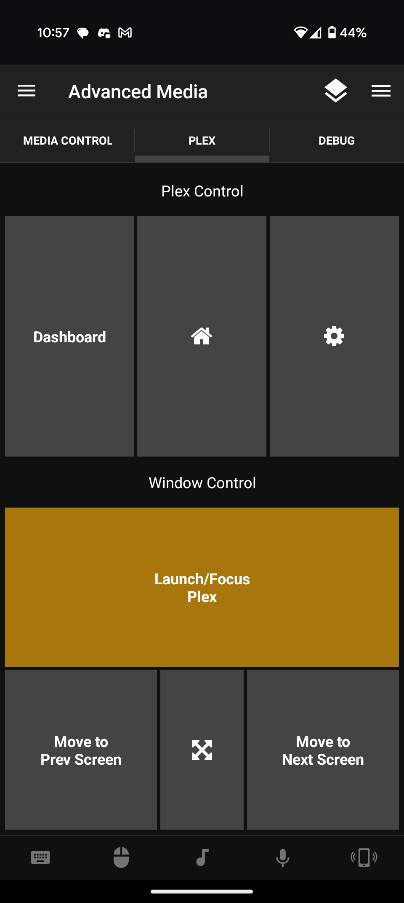

# Unified-Remotes
Custom Remotes for Unified-Remote

## Advanced Remote
A more advanced Media remote for navigation, and Volume control. 
Also included tabs for more specific Plex Window control, as well as a debugger. 

### Features
#### Tab 1 (Media Control)
- Volume control displays the current default playback device (updates on remote open, and in intervals of 5 seconds) 
- Volume slider reflects actual system volume (updates on remote open, and in intervals of 5 seconds) 
- Android Volume rocker buttonscan also control PC system volume.
- Press and hold "Back" button to send "Esc" key
- Press and hold "Play/Pause" button to send "x" key
#### Tab 2 (Plex)
- All "Plex Control" buttons will first attempt to focus the plex window.
- "Launch/Focus Plex" will launch plex if the window is not found, otherwise, it will focus.
- Pressing and holding "Launch/Focus Plex" will kill the Plex process.
- "Move to.." buttons use "Win + arrow Left/Right" to move the currently active window between monitors.
- Fullscreen button sends "Alt+Enter", but does not focus Plex first (Because it's pretty universal)
#### Tab 3 (Debug)
- Hard Coded values for Plex install location and window title/handle appear at the top, these can be changed in the .lua file.
- Current Window Info displays details about the current window info.
- Find Plex returns a value greater than 0 if the window is found. 

  

